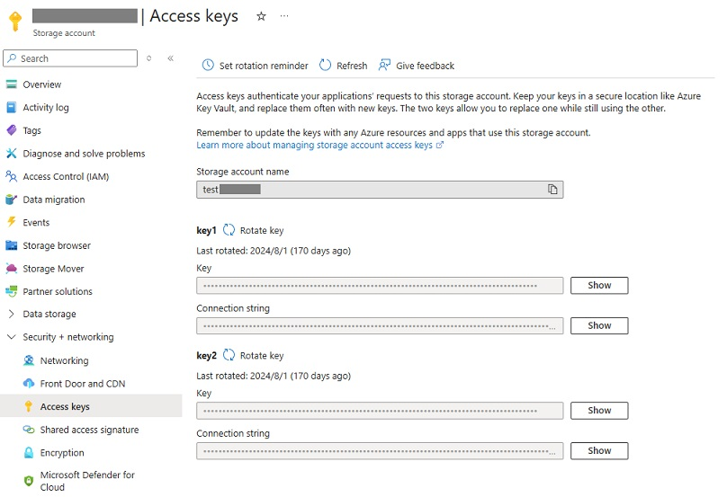
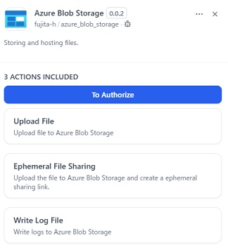
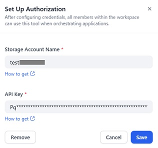
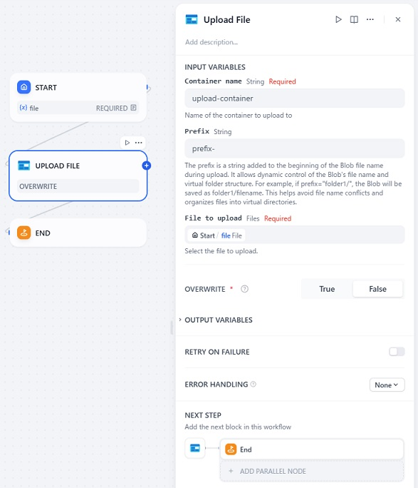

# Overview

This plugin provides tools for uploading and sharing files to Azure Blob Storage.

## Important Notice

This plugin requires an Azure subscription. If you don't have an Azure subscription, create a free account before you begin. Learn more about the free trial [here](https://azure.microsoft.com/free/).

# Tools provided by this plugin

## Upload File

This tool uploads a file to Azure Blob Storage.

## Upload and Share File

This tool uploads a file to Azure Blob Storage and creates a shared access signature (SAS) URL to share the file.

For more information about shared access signatures, see [here](https://learn.microsoft.com/azure/storage/common/storage-sas-overview).

## Write Log

This tool writes a log message to Azure Blob Storage.
One log message is saved per file.

## Configuration

## 1. Create a resource in the Azure portal

Create an Azure Storage Account resource in the Azure portal.

## 2. Get the endpoint and key from the Azure portal

After creating the resource, get the **Storage account name** and **API Key** from the Azure portal.

## 3. Install the plugin

Install the plugin by clicking on the **Install** button.

## 4. Authorize the plugin

Open the plugin, and click on the **To Authorize** button.

Input the **Storage account name** and **API Key** you obtained from the Azure portal, and click on the **Save** button.

## 5. Use the tools provided by the plugin

Add tool to the canvas and configure it.

# Report Issues and Contributing

Please report any issues to the [GitHub repository](https://github.com/fujita-h/dify-plugin-azure-blob-storage).  
This plugin is open-source and contributions are welcome.
